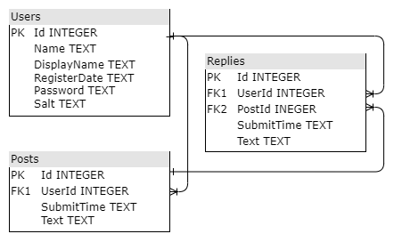
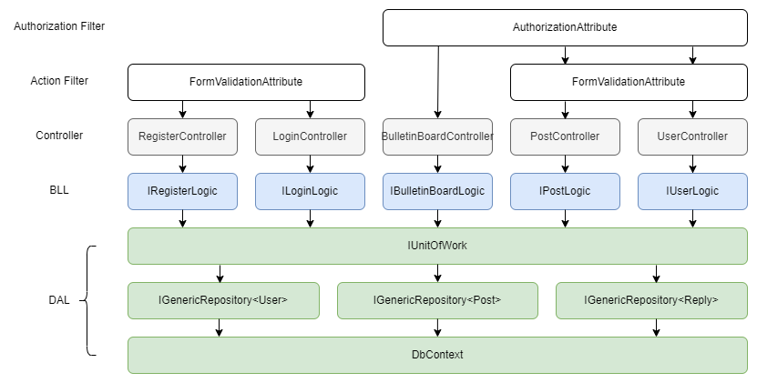

@mainpage

## 開發環境
- [開發環境](#開發環境)
- [專案目錄](#專案目錄)
  - [BulletinBoard 目錄](#bulletinboard-目錄)
    - [Controllers](#controllers)
    - [Infrastructure](#infrastructure)
    - [Models](#models)
    - [Properties](#properties)
    - [Utils](#utils)
    - [Views](#views)
    - [scripts](#scripts)
    - [wwwwroot](#wwwwroot)
  - [Docs 目錄](#docs-目錄)
- [建置專案](#建置專案)
- [資料庫](#資料庫)
  - [DB Schema](#db-schema)
  - [**Users**](#users)
  - [**Posts**](#posts)
  - [**Reply**](#reply)
- [Class Diagram](#class-diagram)
- [網站頁面簡介](#網站頁面簡介)
  - [RegisterController](#registercontroller)
    - [1. `/register`](#1-register)
    - [2. `/register`](#2-register)
  - [LoginController](#logincontroller)
    - [1. `/login`](#1-login)
    - [2. `/login`](#2-login)
  - [BulletinBoardController](#bulletinboardcontroller)
    - [1. `/`、`/bulletinboard`](#1-bulletinboard)
  - [PostController](#postcontroller)
    - [1. `/post/create`](#1-postcreate)
    - [2. `/post/create`](#2-postcreate)
    - [3. `/post/index/{id}`](#3-postindexid)
    - [4. `/post/index/{id}`](#4-postindexid)
  - [UserController](#usercontroller)
    - [1. `/user/changedisplayname`](#1-userchangedisplayname)
    - [2. `/user/changedisplayname`](#2-userchangedisplayname)
- [程式分層](#程式分層)
- [一些 Utils 的實作簡介](#一些-utils-的實作簡介)
  - [Validator](#validator)
  - [Hasher](#hasher)
  - [SessionKeys、TempDataKeys、ViewDataKeys](#sessionkeystempdatakeysviewdatakeys)
- [PostgreSQL 的 Timestamp](#postgresql-的-timestamp)

## 專案目錄

```bash
├───BulletinBoard       # 主程式的目錄
├───BulletinBoard.Test  # Nunit 單元測試 (沒用到)
└───Docs                # 說明文件
```

### BulletinBoard 目錄

```bash
BulletinBoard
├───Controllers
├───Infrastructure  # Filter
├───Models          # 資料庫存取與商務邏輯
├───Properties
├───Utils           # 雜湊、字串驗證等工具
├───Views
├───scripts         # 腳本或其餘外部工具
└───wwwroot
```

#### Controllers  

負責處理用戶的請求並回應，類別名稱必須以 "Controller" 結尾。

```bash
Controllers
├───BulletinBoardController.cs
├───LoginController.cs
...
```

#### Infrastructure

自定義的 Filter，例如 `FormValidationAttribute` 用來驗證使用者輸入的字串是否符合規範。

```bash
Infrastructure
├───AuthorizationAttribute.cs
├───FormValidationAttribute.cs
...
```

#### Models

較為細節的商務邏輯和資料庫存取都在這邊定義與實作。其中 `BusinessLogic` 目錄中實作了每個 Controller 的商務邏輯；`Entities` 目錄定義了資料庫每個實體在記憶體中的資料結構；`Repositories` 目錄中實作了 Repository Pattern。

```bash
Models
├───BusinessLogic
├───Entities
├───Repositories
├───BulletinBoardContext.cs
├───UnitOfWork.cs
...
```

#### Properties

```bash
Properties
└───launchSettings.json
```

`Properties` 目錄有 `launchSettings.json`，其中包含啟動應用程式所需的所有資訊，例如 IIS 設置、URL、身份驗證、SSL port 等。

#### Utils

一些處理資料的小工具，例如 `Hasher` 用來產生 Salt 與雜湊值。

```bash
Utils
├───Validation
├───Hasher.cs
├───IHasher.cs
...
```

#### Views

在 `Views` 目錄中每個目錄名稱都對應一個 Controller，並且與該 Controller 相關的所有 Razor Page 都儲存在其中。

```bash
Views
├───BulletinBoard
├───Login
├───Register
...
```

#### scripts

儲存外部的腳本，例如 SQL 初始化。

```bash
scripts
├───init_postgresql.sql
└───init_sqlite.sql
```

#### wwwwroot

存放網頁所需的靜態文件。

```bash
wwwroot
├───css
├───js
├───lib
...
```

### Docs 目錄

```bash
Docs
├───SystemArchitecture  # 系統架構
├───UserGuide           # 使用說明書
└───Doxygen             # Doxygen 自動產生的 HTML
```

## 建置專案

執行主程式

```
> dotnet restore
> dotnet run
```

## 資料庫

### DB Schema

- Sqlite3:
  ```
  > cd BulletinBoards
  > sqlite3 .db
  sqlite> .read scripts/init_sqlite.sql
  sqlite> .exit
  ```
  
- PostgreSQL:  
  用 `scripts/init_postgresql.sql` 初始化，然後設定以下環境變數讓 `Program.cs` 串接 PostgreSQL。
  ```
  > set DB_NAME=postgresql
  > set CONNECTION_STRING=host=xxxx;port=5432;database=xxxx;username=xxxx;password=xxxx
  ```
  

### **Users**

- 使用者帳號表
- Primary Key: Id

| Column       | Type    | Description       | Nullable | Example             |
| ------------ | ------- | ----------------- | -------- | ------------------- |
| Id           | integer | 從 1 開始的流水號 | N        | 1                   |
| Name         | text    | 帳號名稱          | N        | lin                 |
| DisplayName  | text    | 展示名稱          | Y        | Jack                |
| RegisterDate | text    | 註冊時間          | N        | 0001-01-01 00:00:00 |
| Password     | text    | 密碼              | N        |                     |
| Salt         | text    | 鹽                | N        |                     |

### **Posts**

- 貼文表
- Primary Key: Id

| Column     | Type    | Description       | Nullable | Example                    |
| ---------- | ------- | ----------------- | -------- | -------------------------- |
| Id         | integer | 從 1 開始的流水號 | N        | 1                          |
| UserId     | integer | 作者 FK of `User` | N        | 1                          |
| SubmitTime | text    | 發布時間          | N        | 2022-07-27 17:27:37.245565 |
| Text       | text    | 貼文內容          | N        | Hello World                |

### **Reply**

- 留言表
- Primary Key: Id

| Column     | Type    | Description             | Nullable | Example                    |
| ---------- | ------- | ----------------------- | -------- | -------------------------- |
| Id         | integer | 從 1 開始的流水號       | N        | 1                          |
| UserId     | integer | 作者 FK of `User`       | N        | 1                          |
| PostId     | integer | 回覆的貼文 FK of `User` | N        | 1                          |
| SubmitTime | text    | 發布時間                | N        | 2022-07-27 17:27:37.245565 |
| Text       | text    | 貼文內容                | N        | Hello World                |

## Class Diagram

- 藍色標題的方塊代表**介面**
- 黑色標題代表**類別**
- 虛線箭頭表示**依賴**
- 虛線白色箭頭表示**實作**
- 實線白色箭頭表示**繼承**
- 此類別圖只畫出類別的 public method；另外 static class 如 `SessionKeys` 並沒有畫在圖中。見 `ClassDiagram.drawio`。

所有 Request 都是從左邊先經過 Filter，即 `AuthorizationAttribute` 和 `FormValidationAttribute`，再進入 Controller，然後執行一連串 Logic 與資料庫操作，所以這張 Class Diagram 建議由左往右看。下方的 `User`、`Post`、`Reply` 是資料庫的 Entity 在記憶體中的資料結構。

所有界面與對應的實作都在 `BulletinBoard/Program.cs` 透過 DI Container 注入。


## 網站頁面簡介

### RegisterController

#### 1. `/register`

| `/register`      | `Index()` |
| ---------------- | --------- |
| 導向             | 註冊頁面  |
| Method           | GET       |
| Success Response | Code 200  |

#### 2. `/register`

| `/register`      | `Index([Bind("Name,Password,DisplayName")] User user)`         |
| ---------------- | -------------------------------------------------------------- |
| 導向             | 註冊成功會重新導向到登入頁面。                                 |
| Method           | POST                                                           |
| Success Response | Code 200                                                       |
| 表單資料         | Name=a&Password=a&DisplayName=a&__RequestVerificationToken=... |

### LoginController

#### 1. `/login`

| `/login`         | `Index()` |
| ---------------- | --------- |
| 導向             | 登入頁面  |
| Method           | GET       |
| Success Response | Code 200  |

#### 2. `/login`

| `/login`         | `Index([Bind("Name,Password,DisplayName")] User user)` |
| ---------------- | ------------------------------------------------------ |
| 導向             | 登入                                                   |
| Method           | POST                                                   |
| Success Response | Code 200                                               |
| 表單資料         | Name=a&Password=a&__RequestVerificationToken=...       |

### BulletinBoardController

#### 1. `/`、`/bulletinboard`

| `/bulletinboard` | `Index()`  |
| ---------------- | ---------- |
| 導向             | 布告欄頁面 |
| Method           | GET        |
| Success Response | Code 200   |

### PostController

#### 1. `/post/create`

| `/post/create`   | `Create()`   |
| ---------------- | ------------ |
| 導向             | 新增貼文頁面 |
| Method           | GET          |
| Success Response | Code 200     |

#### 2. `/post/create`

| `/post/create`   | `Create([Bind("Text")] Post post)`                                     |
| ---------------- | ---------------------------------------------------------------------- |
| 導向             | 新增貼文成功後，重新導向到布告欄頁面                                   |
| Method           | POST                                                                   |
| Success Response | Code 200                                                               |
| 表單資料         | Text=Hello!&__RequestVerificationToken=&__RequestVerificationToken=... |

#### 3. `/post/index/{id}`

| `/post/index/{id}` | `Index(int? id)`   |
| ------------------ | ------------------ |
| 導向               | 查看貼文及留言頁面 |
| Method             | GET                |
| Success Response   | Code 200           |

#### 4. `/post/index/{id}`

| `/post/index/{id}` | `Index(int id, string NewReply)`                        |
| ------------------ | ------------------------------------------------------- |
| 導向               | 查看貼文及留言頁面                                      |
| Method             | POST                                                    |
| Success Response   | Code 200                                                |
| 表單資料           | Post.Id=1&NewReply=hello&__RequestVerificationToken=... |

### UserController

#### 1. `/user/changedisplayname`

| `/user/changedisplayname` | `ChangeDisplayName()`     |
| ------------------------- | ------------------------- |
| 導向                      | 更改 `DisplayName` 的頁面 |
| Method                    | GET                       |
| Success Response          | Code 200                  |

#### 2. `/user/changedisplayname`

| `/user/changedisplayname` | `ChangeDisplayName()`                           |
| ------------------------- | ----------------------------------------------- |
| 導向                      | 更改 `DisplayName` 的頁面                       |
| Method                    | POST                                            |
| Success Response          | Code 200                                        |
| 表單資料                  | DisplayName=jack&__RequestVerificationToken=... |

## 程式分層

此圖著重在 Filter、Controller、Model 的互動。見 `BulletinBoard.drawio`。



- **Authorization Filter**  
  Request 進來時，首先透過 `AuthorizationAttribute` 確認應用程式中是否有該使用者的 Session，若有則進入 Action Filter 層；若無則重新導向到 `LoginController` 的 `Index()`。
- **Action Filter**  
  如果此 Request 有傳送表單，則會透過 `FormValidationAttribute` 檢查表單欄位，如果表單有非法字元或長度不符合規範，就將錯誤訊息透過 `ViewData` 回傳給使用者當前的 View。
- **Controller**  
  使用 BLL 提供的商務邏輯組合出資料庫的操作，並決定要回傳哪個 View 以及在 View 中呈現哪些資料。
- **BLL**  
  實作商務邏輯的細節和複雜的資料庫操作，並提供介面給 Controller 使用。例如 `RegisterLogic` 將密碼雜湊運算、`PostLogic` 把某個 `Post` 的 `Reply` 都撈出來。Controller 只需要透過 BLL 提供的介面取得他需要的 Entity、List 等，不用知道演算法、LINQ 語法。
- **DAL: IUnitOfWork**  
  Unit of Work 主要的功能是把數個 CRUD 當作一個 Transaction，在操作的過程在記憶體改變各個 Entity 的狀態，最後再統一刷進資料庫裡。另外 Unit of Wok 可以讓 BLL 只依賴自己，不用直接依賴每個 Repository 的界面，降低 BLL 和 DAL 的耦合度。
- **DAL: IGenericRepository\<TEntity\>**  
  如果不搭配 Unit of Work 的情況下，Repository Pattern 讓 BLL 的邏輯不用直接依賴 Entity Framework。另外 Repository Pattern 方便再單元測試中使用自己的 Mock Data。
- **DAL: DbCotext**  
  使用 Entity Framework 的 API，方便在移轉資料庫時，不用大幅修改程式碼。

## 一些 Utils 的實作簡介

詳情見 API Document。

### Validator

確認字串是否包含非法字元、長度是否符合要求。注入的實作為 `Validator`，其依賴 `StringValidator`，關鍵程式碼:

```csharp
// Validator.cs
public Validator()
{
    _stringValidator = new StringValidator(1, 20, " \\\'\"`");
}
```

在 `Validator` 的建構子定義 `StringValidator` 的規則為: 字串長度介於 1 到 20，並且不包含空格、`\`、`'`、`"`。

### Hasher

隨機產生 Salt 字串、根據密碼和 Salt 產生雜湊字串。注入的實作為 `Hasher`，其依賴 `RandomNumberGenerator` 和 `KeyDerivation`，關鍵程式碼:

```csharp
// Hasher.cs
public string GenerateSaltBase64()
{
    byte[] salt = RandomNumberGenerator.GetBytes(128 / 8);
    return Convert.ToBase64String(salt);
}
```

隨機生成一個 Salt 並轉換成 base64 字串。

```csharp
// Hasher.cs
public string GenerateHashBase64(string password, string saltBase64)
{
    byte[] salt = Convert.FromBase64String(saltBase64);
    byte[] hashed = KeyDerivation.Pbkdf2(
        password: password,
        salt: salt,
        prf: KeyDerivationPrf.HMACSHA256,
        iterationCount: 100000,
        numBytesRequested: 256 / 8
    );
    return Convert.ToBase64String(hashed);
}
```

用密碼和 Salt 作為參數，透過 `Pbkdf2` 產生雜湊值並轉換成 base64 字串。雜湊函數為 `SHA256`、重複加鹽雜湊 100000 次、最後衍生出來的雜湊值長度為 32 byte。

### SessionKeys、TempDataKeys、ViewDataKeys

這三個類別都是靜態類別，利用 `const string` 定義常用的 key-value pair 的 key:

```csharp
// SessionKeys.cs
public static class SessionKeys
{
    public const string UserId = "UserId";
    public const string DisplayName = "DisplayName";
}
```

例如可以這樣使用: `Session[SessionKeys.UserId] = user.Id`。

## PostgreSQL 的 Timestamp

因為 .NET 的 `DateTime` 和 PostgreSQL 的 `timestamptz` 有各自的問題，導致 Npgsql 在轉換時間戳記的時候容易產生不預期的結果，為了解決這個問題，Npgsql 6.0 針對 TimeStamp 做了大幅翻新，翻新的成果也實現了 "UTC everywhere" 的理念。

PostgreSQL 的 `timestamptz` 全名為 `timestamp with time zone`，實際上他不是儲存 time zone，而是 UTC timestamp。為什麼 PostgreSQL 要存 UTC timestamp 而非 time zone? 因為 UTC 可以很單純的用 `+00:00` 直接跟時間存在同一個欄位，而且網頁瀏覽器也很方便處理 UTC 格式，這就是所謂的 "UTC everywhere"。

在 PostgreSQL 資料庫內部他確實是儲存 UTC timestamp，但是從資料庫讀出來的格式是基於 TimeZone connection parameter 的 local timestamp，例如 `2004-10-19 10:23:54+02`，會讓 Npgsql 的 timestamp mapping 誤認為他是 Local DateTime。如果只是用 `DateTime` 實例傳遞資料還好，如果把時間的資料從 `DateTime` 實例中讀出來，原始資料會隱性的被轉換成 time zone 的格式，最後要存回資料庫時，再根據 TimeZone connection parameter 的偏移量存回資料庫，就會存成錯誤的時間。

此外關於 timestamp 和 DateTime 還有許多議題，詳情可參考 [Mapping .NET Timestamps to PostgreSQL](https://www.roji.org/postgresql-dotnet-timestamp-mapping)。為了節省時間，我直接開啟兼容舊版的選項，先不去研究嚴謹的作法:

```csharp
// Program.cs
AppContext.SetSwitch("Npgsql.EnableLegacyTimestampBehavior", true);
AppContext.SetSwitch("Npgsql.DisableDateTimeInfinityConversions", true);
```
