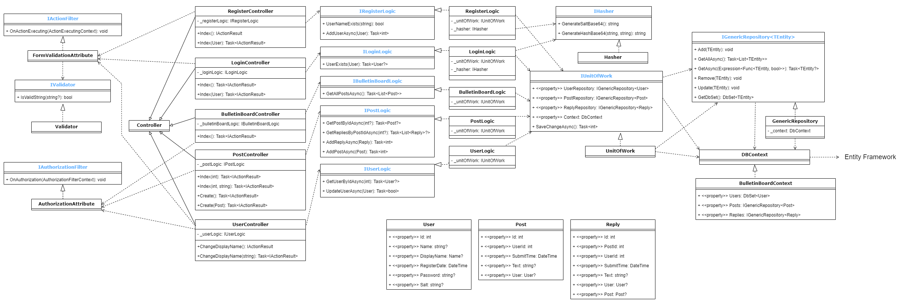

# BulletinBoard System Architecture

## 開發環境

- 作業系統: Windows10
- 使用框架: ASP.NET Core 6 MVC
- 資料庫: SQLite
- SDK 版本: 6.0.301
- 編輯器/IDE: VScode

## 專案目錄

### 主目錄

```bash
├───BulletinBoard       # 主程式的目錄
├───BulletinBoard.Test  # Nunit 單元測試
└───Docs                # 說明文件
```

### BulletinBoard 目錄

```bash
BulletinBoard
├───Controllers
├───Infrastructure  # Filter
├───Models          # 資料庫存取與商務邏輯
├───Properties
├───Utils           # 雜湊、字串驗證等工具
├───Views
├───scripts         # 腳本或其餘外部工具
└───wwwroot
```

#### Controllers  

Controller 負責處理用戶的請求並回應，名稱必須以 "Controller" 結尾。

```bash
Controllers
├───BulletinBoardController.cs
├───LoginController.cs
...
```

#### Infrastructure

自定義的 Filter，例如 `FormValidationAttribute` 用來驗證使用者輸入的字串是否符合規範。

```bash
Infrastructure
├───AuthorizationAttribute.cs
├───FormValidationAttribute.cs
...
```

#### Models

較為細節的商務邏輯和資料庫存取都在這邊定義與實作。其中 `BusinessLogic` 目錄中實作了每個 Controller 的商務邏輯；`Entities` 目錄定義了資料庫每個實體在記憶體中的資料結構；`Repositories` 目錄中實作了 Repository Pattern。

```bash
Models
├───BusinessLogic
├───Entities
├───Repositories
├───BulletinBoardContext.cs
├───UnitOfWork.cs
...
```

#### Properties

```bash
Properties
└───launchSettings.json
```

`Properties` 目錄有 `launchSettings.json`，其中包含啟動應用程式所需的所有資訊，例如 IIS 設置、URL、身份驗證、SSL port 等。

#### Utils

一些處理資料的小工具，例如 `Hasher` 用來產生 Salt 與雜湊值。

```bash
Utils
├───Validation
├───Hasher.cs
├───IHasher.cs
...
```

#### Views

在 `Views` 目錄中每個目錄名稱都對應一個 Controller，並且與該 Controller 相關的所有 Razor Page 都儲存在其中。

```bash
Views
├───BulletinBoard
├───Login
├───Register
...
```

#### scripts

儲存外部的腳本，例如 SQL 初始化。

```bash
scripts
└───init_sqlite.sql
```

#### wwwwroot

存放網頁所需的靜態文件。

```bash
wwwroot
├───css
├───js
├───lib
...
```

## 系統架構

### Class Diagram

- 藍色標題的方塊代表**介面**
- 黑色標題代表**類別**
- 虛線箭頭表示**依賴**
- 虛線白色箭頭表示**實作**
- 實線白色箭頭表示**繼承**
- 此類別圖只畫出類別的 public method；另外 static class 如 `SessionKeys` 並沒有畫在圖中。見 `ClassDiagram.drawio`。

所有 Request 都是從左邊先經過 Filter，即 `AuthorizationAttribute` 和 `FormValidationAttribute`，再進入 Controller，然後執行一連串 Logic 與資料庫操作，所以這張 Class Diagram 建議由左往右看。下方的 `User`、`Post`、`Reply` 是資料庫的 Entity 在記憶體中的資料結構。

所有界面與對應的實作都在 `BulletinBoard/Program.cs` 透過 DI Container 注入。



### 網站頁面簡介

- RegisterController  
  註冊頁面: 處理註冊流程
  + `Index()`: 顯示註冊頁面。
  + `Index([Bind("Name,Password,DisplayName")] User user)`: 接收註冊表單，產生 Salt 與雜湊後的密碼放進 `user`，再將 `user` 存入資料庫。註冊成功後重新導向到登入頁面，並提示註冊成功。

- LoginController  
  登入頁面: 處理登入流程
  + `Index()`: 顯示登入頁面。
  + `Index([Bind("Name,Password")] User user)`: 接收登入表單，把 `user` 的 Salt 撈出來，把表單中的密碼與 Salt 雜湊，比對雜湊後的密碼是否正確。登入成功後重新導向到布告欄頁面。

- BulletinBoardController  
  布告欄頁面: 展示所有貼文
  + `Index()`: 從資料庫撈出所有貼文，展示其內容、發布時間、作者。

- PostController  
  創建貼文頁面: 新增貼文
  + `Create()`: 顯示新增貼文頁面。
  + `Create([Bind("Text")] Post post)`: 接收貼文表單，把 `post` 存進資料庫。
  
  查看貼文頁面: 查看貼文、查看回覆、新增回覆
  + `Index(int? id)`: 展示編號為 `id` 的貼文以及該貼文的回覆。
  + `Index(int id, string NewReply)`: 接收回覆表單，為編號為 `id` 貼文新增一個內容為 `NewReply` 回覆。
- UserController
  更改使用者資料
  + `ChangeDisplayName()`: 顯示更改 `DisplayName` 頁面。
  + `ChangeDisplayName(string DisplayName)`: 接收表單，更改當前使用者的 `DisplayName`。

### 程式分層

此圖著重在 Filter、Controller、Model 的互動。見 `BulletinBoard.drawio`。


- **Authorization Filter**  
  Request 進來時，首先透過 `AuthorizationAttribute` 確認應用程式中是否有該使用者的 Session，若有則進入 Action Filter 層；若無則重新導向到 `LoginController` 的 `Index()`。
- **Action Filter**  
  如果此 Request 有傳送表單，則會透過 `FormValidationAttribute` 檢查表單欄位，如果表單有非法字元或長度不符合規範，就將錯誤訊息透過 `ViewData` 回傳給使用者當前的 View。
- **Controller**  
  使用 BLL 提供的商務邏輯組合出資料庫的操作，並決定要回傳哪個 View 以及在 View 中呈現哪些資料。
- **BLL**  
  實作商務邏輯的細節和複雜的資料庫操作，並提供介面給 Controller 使用。例如 `RegisterLogic` 將密碼雜湊運算、`PostLogic` 把某個 `Post` 的 `Reply` 都撈出來。Controller 只需要透過 BLL 提供的介面取得他需要的 Entity、List 等，不用知道演算法、LINQ 語法。
- **DAL: IUnitOfWork**  
  Unit of Work 主要的功能是把數個 CRUD 當作一個 Transaction，在操作的過程在記憶體改變各個 Entity 的狀態，最後再統一刷進資料庫裡。另外 Unit of Wok 可以讓 BLL 只依賴自己，不用直接依賴每個 Repository 的界面，降低 BLL 和 DAL 的耦合度。
- **DAL: IGenericRepository\<TEntity\>**  
  如果不搭配 Unit of Work 的情況下，Repository Pattern 讓 BLL 的邏輯不用直接依賴 Entity Framework。另外 Repository Pattern 方便再單元測試中使用自己的 Mock Data。
- **DAL: DbCotext**  
  使用 Entity Framework 的 API，方便在移轉資料庫時，不用大幅修改程式碼。

## 一些 Utils 的用途簡介

詳情見 API Document。

- `Utils.Validation.IValidatior`: 確認字串是否包含非法字元、長度是否符合要求。
- `Utils.IHasher`: 隨機產生 Salt 字串、根據密碼和 Salt 產生雜湊字串。
- `Utils.SessionKeys`、`Utils.TempDataKeys`、`Utils.ViewDataKeys`: 這三個類別都是靜態類別，負責定義常用的 key-value pair 的 key 在 `const string` 中，例如可以這樣使用: `Session[SessionKeys.UserId] = user.Id`。