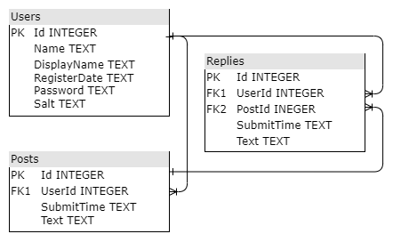
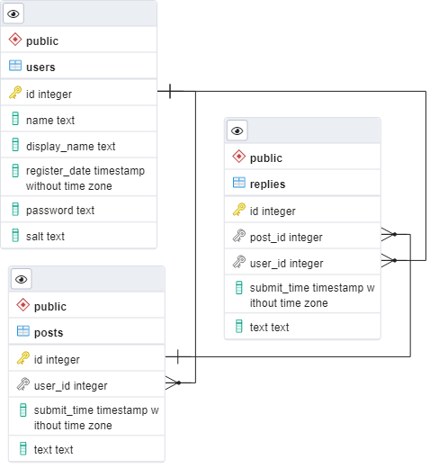
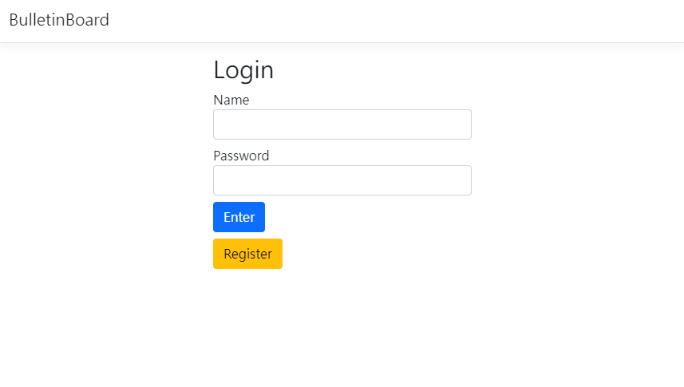
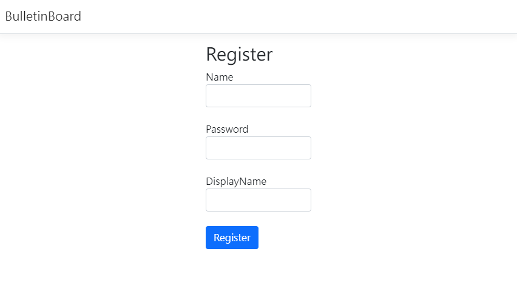
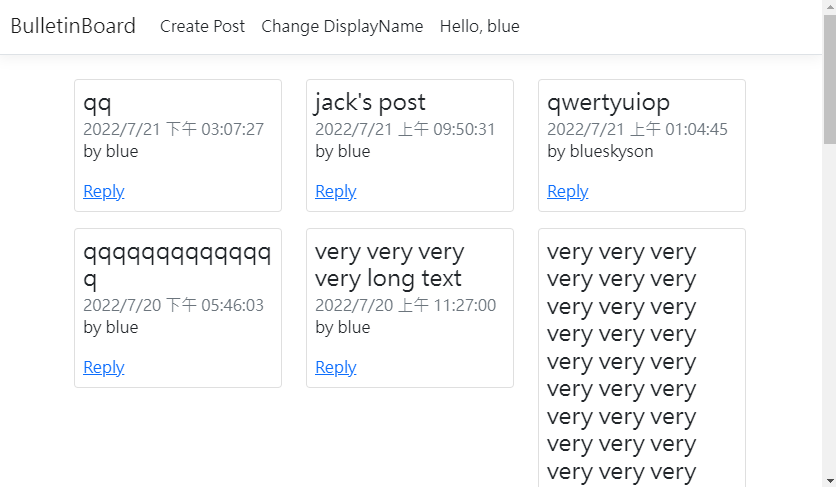
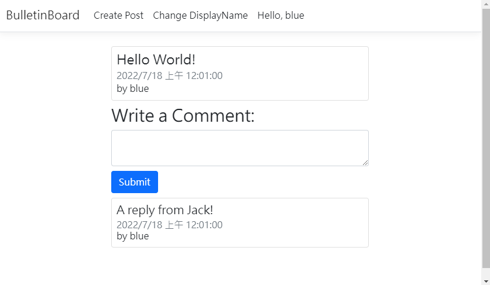

# Bulletin Board

API Docs: [https://jacklin-doxygen.herokuapp.com/](https://jacklin-doxygen.herokuapp.com/)

System Architecture: [SystemArchitecture.md](./Docs/SystemArchitecture/SystemArchitecture.md)

Demo Website: [http://jacklin-bulletinboard.herokuapp.com/](http://jacklin-bulletinboard.herokuapp.com/)

## How to Use

### Setup Database

You can use the default `.db` or initialize database by:

```cmd
> cd BulletinBoards
> sqlite3 .db
sqlite> .read scripts/init_sqlite.sql
sqlite> .exit
```

Sqlite3 DB Schema:



---

It can also use PostgreSQL. Initialize your PostgreSQL database using `BulletinBoard/scripts/init_postgresql.sql` and setup the following environment variables:

```cmd
> set DB_NAME=postgresql
> set CONNECTION_STRING=host=xxxx;port=5432;database=xxxx;username=xxxx;password=xxxx
```

PostgreSQL DB Schema:



### Run the App

```
> cd BulletinBoard
> dotnet restore
> dotnet run
```

## Demo

- Login Page:
  
- Register Page:
  
- Bulletin Board:
  
- Reply a Post:
  
