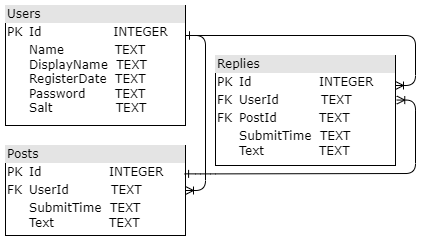

# Bulletin Board

## How to Use

You can use the default `.db` or initialize database by:

```
> cd BulletinBoards
> sqlite3 .db
sqlite> .read scripts/init_sqlite.sql
sqlite> .exit
```

Run the appication:

```
> cd BulletinBoard
> dotnet run
```

Sqlite DB Schema:



## Demo

- Login Page:
  
- Register Page:
  
- Bulletin Board:
  
- Reply a Post:
  
